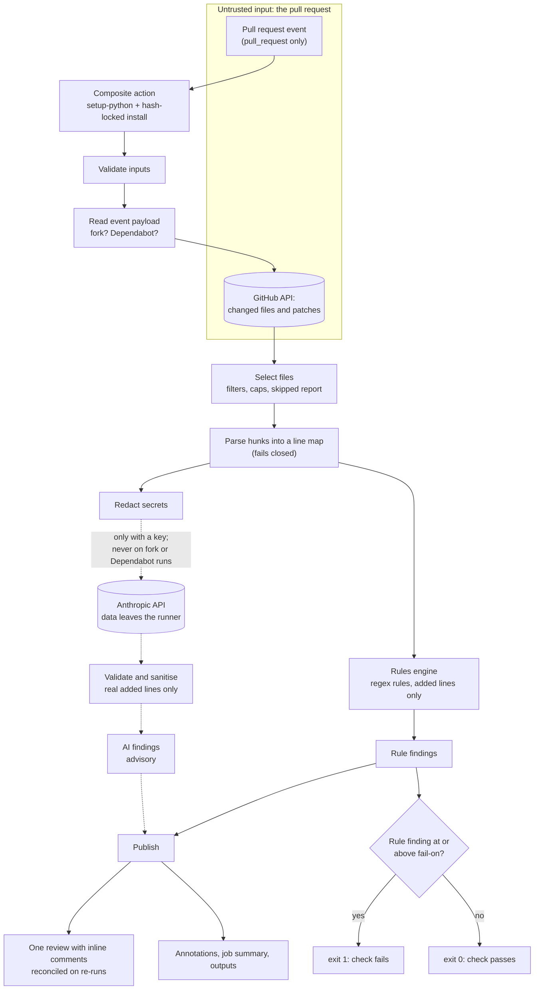

# pr-guardian-action

A GitHub Action that reviews pull requests touching infrastructure and config
files (Terraform, Kubernetes YAML, GitHub Actions workflows, Dockerfiles) and
posts inline review comments.

It combines a fast, deterministic **rules engine** with an optional **AI review
layer**. Rules decide whether the check fails; AI is advisory only. With no API
key it runs in rules-only mode and never contacts anything but GitHub.

> **Status: 1.0.0 release candidate.** The code, tests and docs are complete. It has
> been verified against fakes and one live read-only run on a real PR; posting a
> review, re-run reconciliation and the AI call still need the live checks in
> [docs/RELEASING.md](docs/RELEASING.md), which gate the `v1` tag. This is a
> portfolio project: the rules are deliberately simple regexes so the design is
> easy to read and explain. See [What I would do differently in
> production](#what-i-would-do-differently-in-production).

**Contents:** [Quick start](#quick-start) · [Inputs and outputs](#inputs-and-outputs) ·
[How it works](#how-it-works) · [What you get on a PR](#what-you-get-on-a-pr) ·
[Rules](#rules) · [AI review](#ai-review-optional-advisory) ·
[Security model](#security-model) · [Cost](#cost-estimate) ·
[Limitations](#limitations) · [Try the demo](#try-the-demo) ·
[Versions](#versions-and-pinning) · [Production](#what-i-would-do-differently-in-production) · [Development](#development)

## Quick start

```yaml
name: PR Guardian
on: pull_request            # never pull_request_target - see the security model

permissions:
  contents: read
  pull-requests: write

# A new push supersedes the previous run, so a stale run cannot post against an
# old commit (and cannot spend an AI call on it).
concurrency:
  group: pr-guardian-${{ github.event.pull_request.number }}
  cancel-in-progress: true

jobs:
  review:
    runs-on: ubuntu-latest
    steps:
      - uses: siddharthtp10/pr-guardian-action@v1   # pin a full SHA in production
        with:
          fail-on: high
          paths: "!examples/**"                                # optional exclusions
          anthropic-api-key: ${{ secrets.ANTHROPIC_API_KEY }}  # optional: enables AI advice
```

The Action never checks out your code. It reads the diff through the GitHub API,
so no `actions/checkout` step is needed.

## Inputs and outputs

| Input | Required | Default | Description |
|---|---|---|---|
| `github-token` | no | `github.token` | Reads the diff, posts the review. Must be `GITHUB_TOKEN` or a GitHub App token (see [limitations](#limitations)). |
| `anthropic-api-key` | no | `""` | Enables the AI layer. Pass it from a GitHub secret; empty = rules-only. |
| `model` | no | `claude-sonnet-5-5` | Model for the AI layer. |
| `fail-on` | no | `high` | `low`, `medium`, `high`, `critical` or `none`. Rule findings only. |
| `paths` | no | all supported | Newline/comma separated globs to restrict review. Prefix with `!` to exclude (e.g. `!examples/**`). |
| `max-files` | no | `50` | Max files reviewed per run (1-500). |
| `dry-run` | no | `false` | Run everything except posting the review. The exit code still reflects `fail-on`. |

| Output | Description |
|---|---|
| `conclusion` | `success` or `failure`: rule findings at or above `fail-on`. AI never affects it. |
| `findings-count` | Number of rule findings, at any severity. |
| `ai-findings-count` | Number of advisory AI findings (0 when the AI layer did not run). |

Exit codes: `0` pass, `1` findings at or above `fail-on`, `2` bad input,
unsupported event or bad policy, `3` GitHub API error (including a review that
could not be posted).

## How it works



Dotted lines are the optional AI path. Read the right-hand side as a guarantee:
**AI findings reach *Publish* but never the pass/fail gate.**

Each box is one small module under [`src/pr_guardian/`](src/pr_guardian/):
`config` (inputs), `context` (event, fork detection), `github_api` (stdlib HTTP
client), `selection` + `diff` (what to review and which lines can take a
comment), `engine` + `rules` + `policies/default.yaml` (the rules),
`redact` + `ai_review` (the AI layer), `publish` (reconciling comments),
`cli` (wiring and exit codes).

## What you get on a PR

| Output | Needs write token | Notes |
|---|---|---|
| Check status (exit code) | no | Red when any rule finding is at or above `fail-on`. |
| Annotations | no | `error` for failing findings, `warning` for the rest. Shown on fork PRs too. |
| Job summary | no | Verdict, findings table, files that were not reviewed, AI section and cost. |
| PR review | yes | One review (`COMMENT`, never "request changes") with up to 30 inline comments, most severe first; the rest go in the review body. Skipped in `dry-run` and on read-only runs. |
| Step outputs | no | `conclusion`, `findings-count`, `ai-findings-count`. |

**Re-runs update the review instead of adding to it.** The review body is edited
in place to describe the current state, a comment that still applies is kept,
new findings get new comments, and comments for fixed findings are deleted (or
edited to "Resolved" when someone replied, so the conversation survives). An
identical re-run makes no writes at all. GitHub marks a comment outdated when
its code changes, and then the finding is posted again at its new location. The
check result never depends on existing comments.

**What gets reviewed**

| Kind | Matched by path |
|---|---|
| Terraform | `*.tf`, `*.tfvars` |
| Kubernetes | any other `*.yaml` / `*.yml` outside `.github/` (a heuristic, see [limitations](#limitations)) |
| GitHub Actions | `.github/workflows/*.yml`, `action.yml` |
| Dockerfile | `Dockerfile`, `Dockerfile.*`, `*.dockerfile` |

Files are never silently dropped: anything supported but not reviewed (over
`max-files`, patch too large, no patch from GitHub, unparseable) is listed under
**"NOT reviewed"** in the log, the review and the job summary.

## Rules

27 generic rules ship in [`policies/default.yaml`](src/pr_guardian/policies/default.yaml);
see [docs/rules.md](docs/rules.md) for the table and the known blind spots.
Rules are data (id, severity, file types, regex, message), validated strictly at
load time, and only ever flag **added** lines. Messages are static text and
never echo the matched line, so a secret in a diff is not re-published.

## AI review (optional, advisory)

Set `anthropic-api-key` to add an AI pass for what regex rules cannot see (risky
combinations, missing context, design problems). It is built so that it cannot
hurt you:

- **Advisory only.** AI findings are a different type from rule findings and
  never reach the pass/fail logic: they cannot fail the check, whatever they say.
  Each AI comment is labelled *AI-generated advisory* and says so.
- **Off by default, and off where it is unsafe.** No key = rules-only. Fork and
  Dependabot runs never use the key, even if one is present.
- **Minimal, redacted input.** See [what leaves the runner](#what-leaves-the-runner).
- **The diff is data, not instructions.** It goes only in the user turn, inside
  a random per-run delimiter, and the system prompt says to ignore any
  instructions found in it. Because prompts are not a security boundary, the
  real defences come after the model: structured JSON output, strict
  validation, discarding anything that does not point at a line the PR added,
  and stripping links, HTML and @-mentions before anything is posted.
- **Bounded cost.** One request per run and a pre-flight worst-case cost check;
  see [Cost estimate](#cost-estimate).
- **Fails soft.** Any API error becomes a warning and the run continues with
  rule results.

Re-runs are stable: an AI comment is posted once per line and is not re-written
when the model words things differently; it is retired only when GitHub marks it
outdated. Rules-only runs (a fork, an outage) never delete earlier AI comments.

## Security model

This tool reads **untrusted input** (a pull request) and holds **a write token**
(and optionally an API key). Those two facts drive every decision below.

### Permissions

The workflow grants `contents: read` and `pull-requests: write`; nothing else.
The Action itself makes only pull-request API calls (list files, list and write
reviews and comments) and never reads repository contents. A repository test
fails if any workflow here asks for more.

### What leaves the runner

| Destination | When | What is sent |
|---|---|---|
| `api.github.com` | always | Requests to read the PR's file list and patches and existing reviews/comments, and to write the review. The token goes only to the configured API host: redirects are refused and pagination URLs are never followed. |
| `pypi.org` / `files.pythonhosted.org` | at job start | Package downloads (PyYAML always; the Anthropic SDK only if a key is supplied). Every package is checked against a SHA-256 in the lock file (`pip --require-hashes`). |
| `api.anthropic.com` | **only** with a key, never on fork or Dependabot runs | The system prompt; for each reviewed file its path and the PR's **added and context lines** (each line clipped to 400 characters, after secret redaction); and the rule findings' IDs, severities, paths and line numbers. |

Never sent to Anthropic: removed lines, files that were not reviewed, the
repository checkout (there is none), environment variables, the GitHub token,
or the API key itself beyond its use to authenticate the request. The Action
has no telemetry of its own. What Anthropic does with API data is governed by
its own terms and your agreement with it; read them before enabling the AI layer
on private code.

Redaction (applied before sending, line numbers preserved) masks: AWS, GitHub,
Anthropic, Slack and Google key formats, JWTs, private-key blocks, `user:pass@`
URL credentials, `Authorization: Bearer ...` values, `password = ...`-style
assignments, other high-entropy strings and long hex runs, and the Action's own
key and token. Git SHAs are deliberately kept: they show that an action *is*
pinned. Redaction is heuristic: treat it as a safety net, not a guarantee.

### Fork and Dependabot behaviour

For `pull_request` events, GitHub gives runs triggered from a **fork** a
read-only token and no secrets. Runs triggered by **Dependabot** are treated the
same way. The Action detects both and degrades on purpose:

| | Normal PR | Fork PR | Dependabot run |
|---|---|---|---|
| Token | `pull-requests: write` | read-only | read-only |
| Secrets (API key) | available | none | none |
| Rule review | yes | yes | yes |
| Inline review posted | yes | **no** (would 403) | **no** |
| Findings shown as | review comments | annotations + job summary | annotations + job summary |
| AI layer | if a key is set | **never**, even if a key is present | **never** |
| Check status | by `fail-on` | by `fail-on` | by `fail-on` |
| Log says so | n/a | `NOTICE: fork pull request ...` | `NOTICE: Dependabot run ...` |

The Action refuses to run on `pull_request_target`. That event runs with the
base repository's secrets and a write token while the PR content is
attacker-controlled, and it is the classic way such tools get exploited. It is
not needed here: the plain `pull_request` event is enough because nothing from
the PR is ever checked out or executed.

### Threat model

**Assets:** the write token, the optional API key (and its spend), the integrity
of PR discussion, and the repository's CI.
**Trust boundary:** everything in the pull request (diff text, file names,
comments in the code, and the PR's own workflow changes) is attacker-controlled.

| Threat | Mitigation | Residual risk |
|---|---|---|
| PR content executed on the runner | Nothing is checked out or run; the diff is only read as text through the API. No `pull_request_target`. | None from this path. |
| Malicious file names (newlines, backticks, `::` commands, markdown) | Names are sanitised before the log, annotations, job summary and comments; workflow-command properties escape `%`, `:` and `,`. | Low. |
| Regex denial of service on a crafted line | Rules avoid nested quantifiers; lines over 10,000 characters are reported (not scanned); a test runs every rule against hostile lines with a 1 s budget. | Low. |
| Prompt injection via the diff | Diff is data in the user turn behind a random delimiter; model has no tools; output is schema-checked, mapped to real added lines, and stripped of links/HTML/@-mentions. | A compromised model could still post a short, plain, labelled comment on a changed line. It cannot affect the check. |
| Secret leaked to the AI provider | Redaction before sending; AI skipped on read-only runs. | Heuristic: an unusual secret format may pass. |
| Secret re-published in a review comment | Comments use static policy text; nothing from the diff is quoted. | None known. |
| Forged markers or comments to suppress or redirect findings | Only comments and reviews authored by an account of type `Bot` are trusted or edited. The check never reads comments. | A malicious GitHub App with access to the repo. |
| Compromised dependency or Action tag | Third-party Actions and pre-commit hooks are pinned to full commit SHAs; all Python dependencies, including transitive ones, are hash-locked and installed with `--require-hashes`. | The runner image and GitHub's own infrastructure. |
| Token or key exfiltration by this code | The token only goes to the configured HTTPS API host; redirects refused; the API key is only passed to the one step that needs it and is never printed; exception text from the SDK is not logged (only a class-based description). | A PR author with write access can change the Action's code in their branch if a workflow uses `uses: ./`. Consumers should reference the published, SHA-pinned Action instead. |
| Cost abuse (spamming PRs to burn API credit) | Fork/Dependabot runs never call the API; one request per run; per-run cap; a `concurrency` group cancels superseded runs. | Anyone who can open same-repo PRs can trigger spend up to the cap per push. |
| Workflow-command injection through inputs | Inputs are passed via `env:`, never interpolated into shell; messages are escaped. | None known. |

Out of scope: a compromised GitHub account with admin rights, a malicious
repository owner, vulnerabilities in GitHub or Anthropic themselves.

## Cost estimate

**Rules-only: $0** beyond Actions minutes. A rules-only run takes a few seconds
of runner time (about 6 s end to end in this repository's CI); on private
repositories GitHub rounds each job up to a whole minute. Public repositories
use standard runners free.

**With the AI layer** the cost of one run is
`input_tokens x input_price + output_tokens x output_price`. The code enforces
a worst case before calling: one request, at most 4,000 output tokens, about
30,000 input tokens (estimated at a pessimistic 3 characters per token), and a
$0.25 per-run cap that shrinks the input or skips the call for expensive models.

| Model (`model` input) | $ per M tokens in / out | Max input tokens sent | Worst case per run | Small PR* |
|---|---|---|---|---|
| `claude-haiku-4-5` | 1.00 / 5.00 | 30,000 | $0.0500 | $0.0070 |
| `claude-sonnet-5-5` (default) | 2.00 / 10.00 | 30,000 | $0.1000 | $0.0140 |
| `claude-opus-5-5` | 4.00 / 20.00 | 30,000 | $0.2000 | $0.0280 |
| `claude-fable-5-1` | 10.00 / 50.00 | 4,999 | $0.2500 | $0.0700 |

\* Illustrative, not measured: 3,000 input and 800 output tokens. Prices are
from Anthropic's models overview, checked 2026-10-03; Haiku 4.5's published
retirement date is no sooner than 2026-10-15, which is why it is not the
default. Unknown model names are priced as the most expensive row, so the cap
errs safe. Real usage and cost for every run are printed in the log and job
summary, so you can replace these estimates with your own numbers.

*Illustration of scale (assumptions, not data):* 40 PRs a month, three pushes
each, default model, small PRs: 120 runs x $0.014 is about $1.70 a month; if
every run hit the worst case it would be $12.

## Limitations

- **It sees the diff, not the repository.** A rule that needs context outside
  the changed hunks stays silent rather than guessing (for example when the
  `ingress {` opener or a container's last line is not in the diff). That is a
  documented false negative by design. See [docs/rules.md](docs/rules.md).
- **Regex rules, not parsers.** No Terraform variable/module evaluation, no Helm
  templating, no Kubernetes schema validation, and rules assume formatted code
  (`terraform fmt`, standard YAML indentation).
- **Kubernetes detection is by path.** Any `*.yaml` outside `.github/` is
  treated as a manifest, so e.g. a Helm `values.yaml` with a separate `tag:` can
  trigger the untagged-image rule.
- **Heuristic secret detection.** The secret rules and redaction find common
  formats, not everything. Use a dedicated secret scanner as well.
- **Size limits.** At most 3,000 files are visible (a GitHub API limit),
  per-file and total patch size are capped, and GitHub omits the patch for very
  large or binary files; all of these are reported as not reviewed.
- **Comment limits.** At most 30 inline comments per review (the rest are listed
  in the body). The Action emits every annotation, but GitHub displays only the
  first 10 errors and 10 warnings per step; the job summary lists them all.
- **AI output is non-deterministic.** The same code may be described differently
  on another run; this is why AI comments are never rewritten and never gate.
- **Token type.** Re-run reconciliation recognises its own comments by account
  type `Bot`, so a personal access token (which posts as a `User`) is not
  supported.
- **Untested against live services so far.** The test-suite uses fakes for
  GitHub and Anthropic. The first real runs are the proof; the manual checks are
  listed in [docs/interview-notes.md](docs/interview-notes.md).
- **Not a replacement** for `terraform plan` review, policy-as-code (OPA,
  Conftest), Checkov/tfsec/kube-linter, secret scanning or human review.

## Try the demo

[`examples/`](examples/) holds four intentionally insecure files (Terraform,
Kubernetes, a Dockerfile and an inert workflow) and
[`scripts/open-demo-pr.sh`](scripts/open-demo-pr.sh) copies them onto a scratch
branch and opens a **draft** PR so you can watch the Action review it.

```bash
scripts/open-demo-pr.sh --dry-run                 # show what it would do; changes nothing
scripts/open-demo-pr.sh                           # create the scratch branch + draft PR
scripts/open-demo-pr.sh --cleanup demo/pr-guardian-YYYYMMDD-HHMMSS   # close it, delete the branch
```

It needs `git` and an authenticated `gh`. It only pushes the new scratch branch
(never forced), never merges, never edits repository settings and never touches
secrets. If the repository has an `ANTHROPIC_API_KEY` secret the demo PR makes
one AI call. Expect inline comments, a red check and a job summary. That is the
point; never merge it. [`examples/README.md`](examples/README.md) lists what
each file should trigger, and a test keeps that list true.

## Versions and pinning

Releases follow [Semantic Versioning](https://semver.org/) and are listed in
[CHANGELOG.md](CHANGELOG.md). Three ways to reference the Action, from least to
most strict:

| Reference | Moves? | Use when |
|---|---|---|
| `@v1` | yes: newest `1.x.y` | you want fixes automatically and trust the maintainer |
| `@v1.0.0` | no (never moved once published) | you want an exact, readable version |
| `@<full 40-character SHA>` | never | production: a tag can be re-pointed, a commit SHA cannot |

```yaml
- uses: siddharthtp10/pr-guardian-action@<full-40-char-sha>  # v1.0.0
```

Report vulnerabilities privately as described in [SECURITY.md](SECURITY.md). How
releases and the floating tag are made, and the checks that gate them, are in
[docs/RELEASING.md](docs/RELEASING.md).

## What I would do differently in production

This project optimises for being explainable. A production version would change:

- **Run as a GitHub App**, not `GITHUB_TOKEN`. A real identity, fine-grained
  permissions, proper **Check Runs** with rich annotations (instead of using the
  job's exit code as the check), better rate limits, and none of the
  token-type caveats above.
- **Use real parsers and existing engines** (an HCL parser, a YAML AST, OPA /
  Conftest, Checkov, kube-linter) instead of regexes, and fetch full file
  contents through the contents API for rules that need context.
- **Safely support fork PRs with write access** using the two-workflow pattern:
  an unprivileged `pull_request` workflow produces results as an artifact, and a
  separate `workflow_run` workflow, which runs no PR code, posts them.
- **Per-organisation policy**: shared rule sets, severity overrides, inline
  suppressions with a reason and an audit trail, and baselines so adopting it
  does not flood existing code.
- **Dedicated secret scanning** (gitleaks, trufflehog, GitHub secret scanning)
  instead of heuristics, and push protection upstream of review.
- **AI quality and governance**: an eval set of labelled PRs to measure
  precision before each prompt or model change, versioned prompts, a feedback
  signal from dismissed comments, per-repo opt-in and path allow-lists, data
  retention and residency review, and cost dashboards.
- **Supply chain**: Dependabot/Renovate for Actions and the lock files, a CI
  check that locks are not stale, signed tags, release provenance (SLSA
  attestations) and an SBOM.
- **Observability and contract tests**: metrics on findings per rule, false
  positive rate and run time; tests recorded against the real GitHub and
  Anthropic APIs in a sandbox repository, not only fakes.
- **Robustness**: honour `Retry-After` and secondary rate limits, idempotency for
  multi-step posting, `merge_group` support, and monorepo-scale batching.

## Development

```bash
python -m venv .venv && source .venv/bin/activate
pip install -r requirements-dev.txt
pre-commit install
pytest && ruff check . && ruff format --check .
```

Runtime dependencies are hash-locked. To change one, edit `requirements.in` or
`requirements-ai.in` (and the matching pin in `pyproject.toml` and
`requirements-dev.txt`; a test checks they agree), then regenerate with:

```bash
uv pip compile --python-version 3.12 --python-platform linux --generate-hashes \
  --no-header requirements.in -o requirements.txt
uv pip compile --python-version 3.12 --python-platform linux --generate-hashes \
  --no-header requirements-ai.in -o requirements-ai.txt
```

Before making a repository public (or tagging a release), run the audit. It scans
the tracked files **and the full history** for secrets, sensitive file names,
personal paths and caller-supplied terms, and never prints a matched value:

```bash
AUDIT_EXTRA_TERMS="name-one,name-two" scripts/audit-public.sh
```

Interview preparation notes for every stage are in
[docs/interview-notes.md](docs/interview-notes.md).

## License

MIT
